# EasyMart

[English](#easymart) | [Tiếng Việt](#tieng-viet)

EasyMart is an Android e-commerce application with customer and administrator flows. It is built with Kotlin, Jetpack Compose, MVVM, and a layered Clean Architecture structure. The app covers product discovery, an offline-first cart, checkout and order management, while integrating Room, Firebase, Algolia, ML Kit OCR, Gemini, and PayOS-related payment APIs. The project focuses on practical Android concerns such as reactive UI state, local and remote data synchronization, role-based navigation, and resilient data handling.

## Demo

The screenshots below are captured from the running Android application and highlight the main customer and administrator workflows.

### Home and product search

<table>
  <tr>
    <td width="33%" align="center">
      <br>
      <sub><b>Home and featured products</b></sub>
    </td>
    <td width="33%" align="center">
      <br>
      <sub><b>Recommendations and stock status</b></sub>
    </td>
    <td width="33%" align="center">
      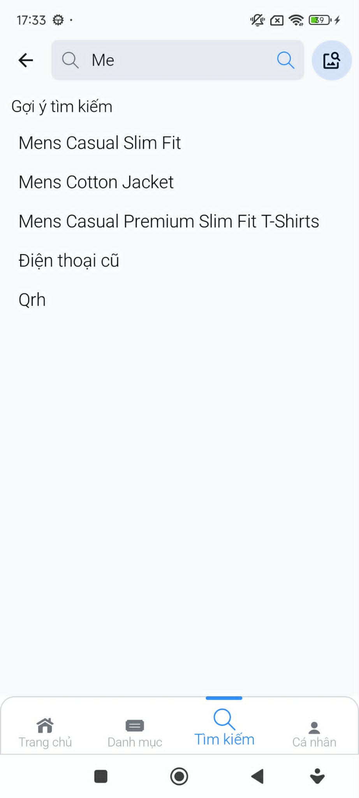<br>
      <sub><b>Live keyword suggestions</b></sub>
    </td>
  </tr>
</table>

`home3` shows the active product-search state, where matching keyword suggestions are displayed while the user enters a query.

### Product discovery

<table>
  <tr>
    <td width="33%" align="center">
      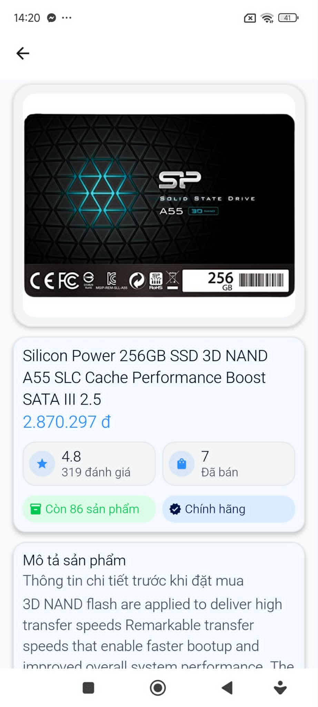<br>
      <sub><b>Product information and inventory</b></sub>
    </td>
    <td width="33%" align="center">
      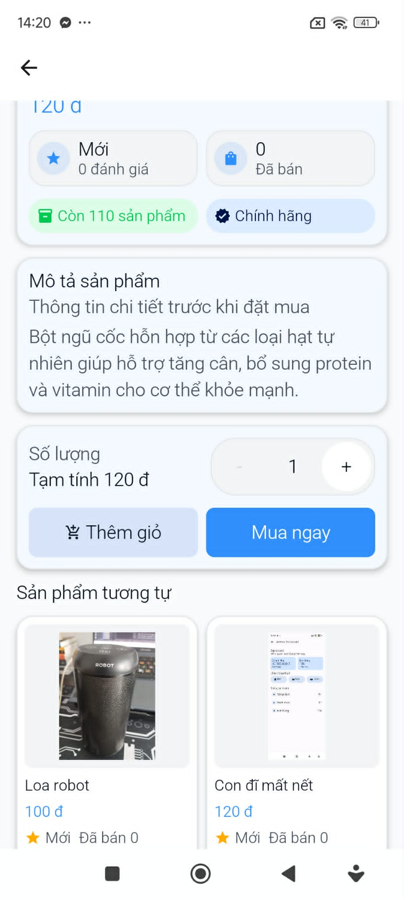<br>
      <sub><b>Purchase controls and related items</b></sub>
    </td>
    <td width="33%" align="center">
      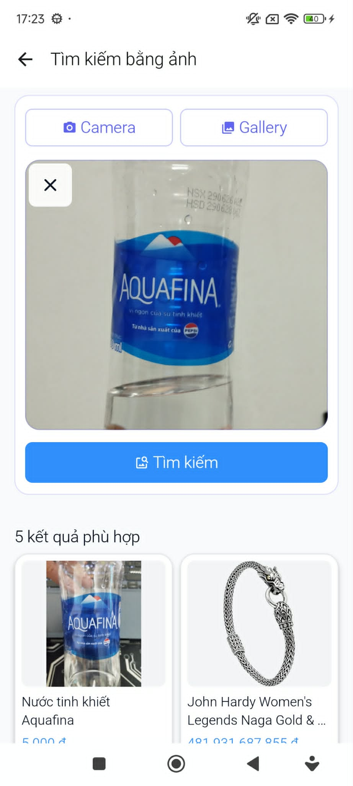<br>
      <sub><b>Image search and similar results</b></sub>
    </td>
  </tr>
</table>

### Shopping, payment, and orders

<table>
  <tr>
    <td width="33%" align="center">
      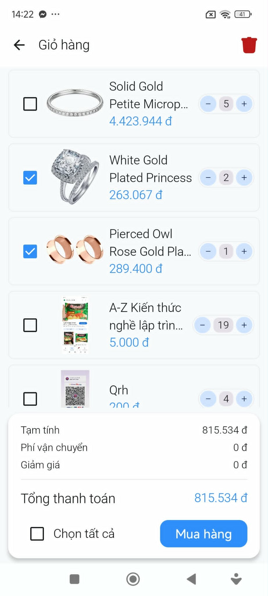<br>
      <sub><b>Cart selection and quantities</b></sub>
    </td>
    <td width="33%" align="center">
      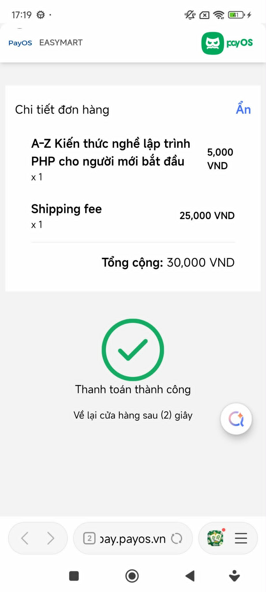<br>
      <sub><b>PayOS payment result</b></sub>
    </td>
    <td width="33%" align="center">
      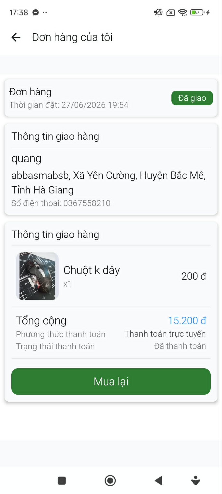<br>
      <sub><b>Order status and payment details</b></sub>
    </td>
  </tr>
</table>

### Administrator product workflow

<table>
  <tr>
    <td width="33%" align="center">
      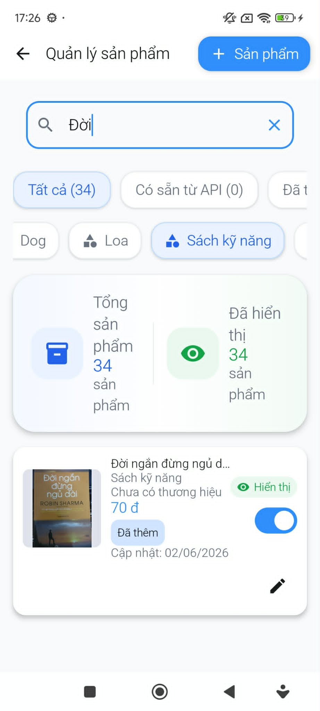<br>
      <sub><b>Search, filters, and visibility</b></sub>
    </td>
    <td width="33%" align="center">
      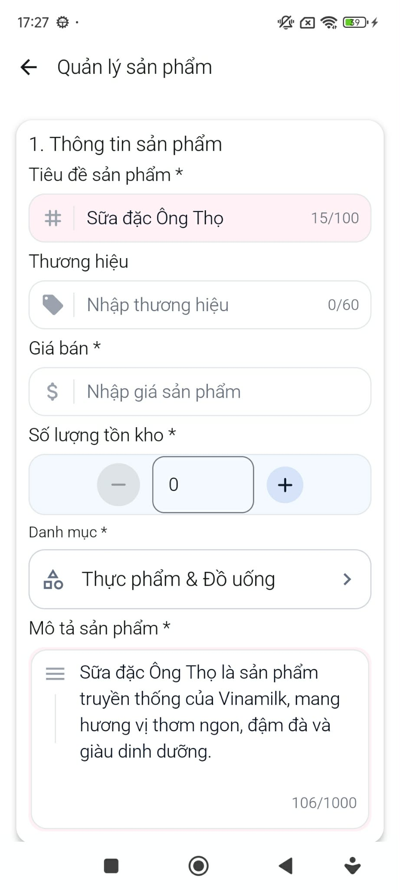<br>
      <sub><b>Validated product information</b></sub>
    </td>
    <td width="33%" align="center">
      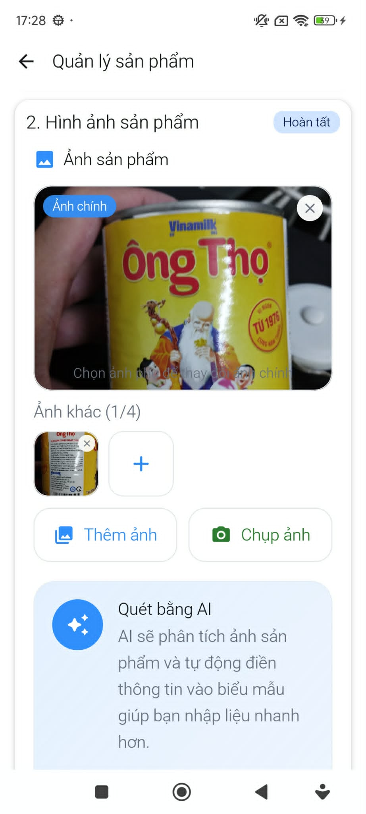<br>
      <sub><b>Multi-image upload and AI scan</b></sub>
    </td>
  </tr>
</table>

## Key Features

### Authentication and access control

- Email and password registration, login, logout, and password reset with Firebase Authentication
- User profile data stored in Cloud Firestore
- Customer and administrator access resolved from Firebase claims and user profile data
- Login-required and admin-required navigation guards

### Product discovery

- Home, category, product list, and product detail experiences
- Product data combined from Fake Store API and Cloud Firestore, then cached in Room
- Category filtering, sorting, stock information, and multi-image product galleries
- Keyword search and query suggestions through the Algolia Kotlin client
- Algolia credentials requested from a companion API instead of being embedded in the app

### Image search and AI-assisted product entry

- Image selection from the gallery or camera using Activity Result APIs and `FileProvider`
- Multipart image upload to a companion Image Search API and display of similar products
- On-device text extraction from product images with ML Kit Text Recognition
- Gemini-based normalization of OCR text into suggested title, category, description, and confidence fields
- AI suggestions integrated into the administrator product editor

### Offline-first cart and synchronization

- Room-backed cart used as the local source of truth
- Immediate local add, quantity update, and deletion with pending synchronization flags
- Guest cart merge after authentication
- Push and pull synchronization with Firestore, protected by a `Mutex`
- Timestamp-based conflict handling and deletion preservation during cart merging

### Checkout, payment, and orders

- Cart checkout and quick checkout flows
- Delivery address management using province and district data from `provinces.open-api.vn`
- Cash on delivery, local wallet, and online gateway payment paths
- PayOS checkout opened with Chrome Custom Tabs, followed by deep-link return/cancel handling and payment-status polling
- Local order persistence, pending-order synchronization, remote order observation, and stock deduction
- Customer cancellation rules and administrator handling for order status, cancellation approval, stock restoration, and manual refunds

### Administrator tools

- Administrator dashboard
- Product listing, search, filtering, sorting, visibility control, stock management, and product details
- Add and edit products with validation, one primary image, multiple secondary images, and Firebase Storage upload
- Order listing, search, filtering, order details, status transitions, cancellation approval, and refund confirmation

## Tech Stack

| Area | Technologies and usage |
| --- | --- |
| Language | **Kotlin**; JVM target 11 |
| UI | **Jetpack Compose**, **Material 3**, Compose previews, and Activity Result APIs |
| Navigation | **Navigation Compose** with nested graphs, typed route arguments, access guards, and payment deep links |
| Architecture | **MVVM** and layered **Clean Architecture** with presentation, domain, and data packages |
| State and async work | **Kotlin Coroutines**, **Flow**, `StateFlow`, `SharedFlow`, and `callbackFlow` |
| Dependency injection | **Dagger Hilt** for ViewModels, repositories, data sources, Room, Retrofit, Firebase, and workers |
| Local persistence | **Room** with entities, DAOs, local data sources, and explicit database migrations |
| Cloud services | **Firebase Authentication**, **Cloud Firestore**, **Firebase Storage**, and **Firebase Cloud Messaging** |
| Search | **Algolia Kotlin client** for product search and suggestions; companion API for scoped credentials |
| Networking | **Retrofit**, **OkHttp**, and **Gson** for products, locations, AI, image search, and payment APIs |
| AI and vision | **ML Kit Text Recognition** for OCR and **Gemini API** for structured product suggestions |
| Images and files | **Coil**, `FileProvider`, camera/gallery contracts, and multipart upload |
| Testing | **JUnit 4**, **MockK**, **Kotlinx Coroutines Test**, **AndroidX Core Testing**, and **Truth** |

## Architecture

The codebase separates UI concerns, business rules, and data access:

- **Presentation** contains Compose screens, navigation, ViewModels, UI state, and one-off UI events.
- **Domain** contains models, repository contracts, use cases, payment strategies, shipping rules, and order cancellation policies.
- **Data** contains Room entities and DAOs, Firebase and Retrofit data sources, DTOs, mappers, repository implementations, network observation, and worker implementations.

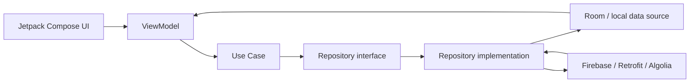

For the cart, Room is the observable source used by the UI. Changes are written locally first and marked unsynchronized. When an authenticated user has network access, `AppSyncViewModel` triggers cart, address, and pending-order synchronization while also observing remote order changes. Cart synchronization pushes pending local changes, fetches the Firestore snapshot, and merges records using deletion state, synchronization state, and update timestamps.

## Project Structure

```text
EasyMart/
|-- app/
|   |-- src/main/java/com/example/easymart/
|   |   |-- presentation/       # Compose UI, ViewModels, navigation, state, theme
|   |   |-- domain/             # Models, repository contracts, use cases, business rules
|   |   |-- data/               # Room, Firebase, Retrofit, DTOs, mappers, repositories
|   |   |-- di/                 # Hilt modules for app dependencies
|   |   |-- service/            # Firebase Messaging service
|   |   `-- utils/              # Currency, date, order, and payment helpers
|   |-- src/test/               # Local unit tests
|   `-- src/androidTest/        # Basic instrumented test scaffold
|-- gradle/libs.versions.toml   # Central dependency version catalog
|-- build.gradle.kts            # Root Gradle configuration
`-- settings.gradle.kts         # Single Android app module declaration
```

## Technical Highlights

- **Local-first data flow:** cart and other commerce data are persisted with Room so Compose screens can observe stable local flows.
- **Conflict-aware cart synchronization:** pending updates, soft deletions, timestamps, and a synchronization mutex prevent overlapping merges and accidental item restoration.
- **Multi-source product repository:** REST and Firestore product records are normalized through mappers and persisted into the same Room-backed stream.
- **Reactive application state:** ViewModels expose immutable `StateFlow` and `SharedFlow`; Firebase listeners and Android connectivity callbacks are adapted into Flow.
- **Clear data boundaries:** domain models, Room entities, remote DTOs, and search hits are converted through dedicated mapper functions.
- **Secure search integration:** the app requests short-lived Algolia credentials from a companion endpoint before initializing the search client.
- **Complete commerce navigation:** nested Compose graphs connect authentication, customer shopping, checkout, payment callbacks, order management, and guarded administrator screens.

## Getting Started

### Requirements

- Android Studio with Android SDK 36
- JDK 17 or later for Gradle (the app compiles Kotlin and Java source to JVM target 11)
- Android device or emulator running Android 7.0 (API 24) or later
- A Firebase project with Authentication, Firestore, Storage, and Cloud Messaging configured
- A Gemini API key for the OCR normalization feature
- Reachable companion endpoints for Algolia credentials, image search, and PayOS payment operations

### Setup

1. Clone the repository:

   ```bash
   git clone https://github.com/quang020105/EasyMart-Android.git
   cd EasyMart-Android
   ```

2. Open the project in Android Studio and allow Gradle synchronization to finish.

3. Add or replace the Firebase Android configuration at `app/google-services.json` with a configuration matching the `com.example.easymart` application ID.

4. Add the Gemini key to the root `local.properties` file:

   ```properties
   GEMINI_API_KEY=your_gemini_api_key
   ```

5. Update the development server addresses in `app/src/main/java/com/example/easymart/di/NetworkModule.kt` for the device or emulator running the app. The current source uses LAN addresses for Algolia/Image Search and payment companion APIs.

6. Build and run from Android Studio, or use:

   ```bash
   ./gradlew assembleDebug
   ```

   On Windows PowerShell:

   ```powershell
   .\gradlew.bat assembleDebug
   ```

For a backend running on the development machine, use a reachable LAN address or configure `adb reverse` for the corresponding port when supported by the connected device setup.

## Testing

The repository contains focused unit tests for cart and address ViewModel behavior, shipping-fee rules, and order-cancellation policy. Several additional ViewModel test files currently define planned scenarios with TODO bodies. The test setup uses JUnit 4, MockK, Kotlinx Coroutines Test, AndroidX Core Testing, and Truth; AndroidX also provides a basic instrumented test scaffold.

Run local tests with:

```bash
./gradlew testDebugUnitTest
```

The current test sources need maintenance after recent production-model and ViewModel constructor changes before the complete suite compiles successfully.

## Challenges and Solutions

### Keeping the cart usable offline

Cart actions write to Room immediately and expose the updated data through Flow. Records carry synchronization and deletion metadata, allowing the app to defer remote work without blocking the shopping experience.

### Merging local and remote cart changes

Synchronization first pushes pending records, then pulls Firestore data. A mutex prevents concurrent sync passes, while timestamps and soft-deletion rules decide whether local or remote state should win.

### Combining product data from multiple sources

The product repository maps Fake Store API and Firestore records into a common local entity. Room then provides one observable product stream to the UI, while update timestamps and synchronization flags support remote reconciliation.

### Coordinating payment state across app and browser

Online payment leaves the app through a Chrome Custom Tab. Custom deep links return control to the navigation graph, after which the app polls the companion payment API and updates local order and payment state.

## Future Improvements

- Replace hard-coded development base URLs with build variants or environment-driven configuration.
- Update stale tests and add repository synchronization, Compose UI, and end-to-end checkout coverage.
- Add durable constrained background synchronization for pending local changes.
- Complete the administrator category-management screen, which is currently a placeholder route.
- Add a short walkthrough video or GIF and document the companion API setup in a separate guide.

## Author

- GitHub: [quang020105](https://github.com/quang020105)
- Repository: [EasyMart-Android](https://github.com/quang020105/EasyMart-Android)

---

<details id="tieng-viet">
<summary><strong>Đọc README bằng tiếng Việt</strong></summary>

<br>

## EasyMart - Tiếng Việt

EasyMart là ứng dụng thương mại điện tử Android gồm luồng khách hàng và quản trị viên. Ứng dụng được xây dựng bằng Kotlin, Jetpack Compose, MVVM và tổ chức theo Clean Architecture phân lớp. Dự án triển khai các luồng duyệt sản phẩm, giỏ hàng offline-first, thanh toán và quản lý đơn hàng, đồng thời tích hợp Room, Firebase, Algolia, ML Kit OCR, Gemini và các API thanh toán liên quan đến PayOS. Trọng tâm kỹ thuật của dự án là quản lý trạng thái UI phản ứng, đồng bộ dữ liệu local/remote, điều hướng theo quyền người dùng và xử lý dữ liệu ổn định khi kết nối mạng thay đổi.

### Demo

Bộ ảnh demo thực tế được trình bày tại phần [Demo tiếng Anh](#demo) phía trên, gồm bốn nhóm:

- **Trang chủ và tìm kiếm:** sản phẩm nổi bật, danh sách gợi ý và trạng thái tìm kiếm từ khóa trực tiếp. `home3` là màn hình đang nhập nội dung tìm kiếm và hiển thị các từ khóa gợi ý phù hợp.
- **Khám phá sản phẩm:** thông tin chi tiết, tồn kho, thao tác mua và tìm kiếm sản phẩm tương tự bằng hình ảnh.
- **Mua hàng và đơn hàng:** chọn sản phẩm trong giỏ, kết quả thanh toán PayOS và theo dõi trạng thái đơn.
- **Quản trị sản phẩm:** tìm kiếm/lọc sản phẩm, nhập thông tin có validation, upload nhiều ảnh và quét ảnh bằng AI.

### Chức năng chính

#### Xác thực và phân quyền

- Đăng ký, đăng nhập, đăng xuất và đặt lại mật khẩu bằng Firebase Authentication
- Lưu hồ sơ người dùng trên Cloud Firestore
- Xác định quyền khách hàng/quản trị viên từ Firebase claim và dữ liệu hồ sơ
- Kiểm soát các màn hình yêu cầu đăng nhập hoặc quyền quản trị trong luồng điều hướng

#### Khám phá và tìm kiếm sản phẩm

- Trang chủ, danh mục, danh sách và chi tiết sản phẩm
- Kết hợp dữ liệu sản phẩm từ Fake Store API và Cloud Firestore, sau đó lưu vào Room
- Lọc theo danh mục, sắp xếp, hiển thị tồn kho và thư viện nhiều ảnh sản phẩm
- Tìm kiếm theo từ khóa và gợi ý truy vấn bằng Algolia Kotlin client
- Lấy thông tin xác thực Algolia từ companion API thay vì nhúng trực tiếp vào ứng dụng

#### Tìm kiếm bằng ảnh và hỗ trợ nhập sản phẩm bằng AI

- Chọn ảnh từ thư viện hoặc chụp ảnh bằng Activity Result API và `FileProvider`
- Upload ảnh multipart lên Image Search API và hiển thị các sản phẩm tương tự
- Trích xuất văn bản trên thiết bị bằng ML Kit Text Recognition
- Dùng Gemini chuẩn hóa kết quả OCR thành tên, danh mục, mô tả và độ tin cậy gợi ý
- Tích hợp kết quả AI vào màn hình thêm/sửa sản phẩm của quản trị viên

#### Giỏ hàng offline-first và đồng bộ dữ liệu

- Sử dụng giỏ hàng trong Room làm nguồn dữ liệu local chính
- Thêm sản phẩm, cập nhật số lượng và xóa local ngay lập tức, kèm trạng thái chờ đồng bộ
- Hợp nhất giỏ hàng khách vào tài khoản sau khi đăng nhập
- Đồng bộ hai chiều với Firestore và dùng `Mutex` để tránh chạy nhiều tiến trình đồng bộ đồng thời
- Giải quyết xung đột bằng thời gian cập nhật, trạng thái đồng bộ và trạng thái xóa

#### Checkout, thanh toán và đơn hàng

- Checkout từ giỏ hàng và luồng mua nhanh
- Quản lý địa chỉ giao hàng với dữ liệu tỉnh/thành, quận/huyện từ `provinces.open-api.vn`
- Hỗ trợ thanh toán khi nhận hàng, ví local và cổng thanh toán trực tuyến
- Mở trang PayOS bằng Chrome Custom Tabs, xử lý deep link return/cancel và polling trạng thái thanh toán
- Lưu đơn hàng local, đồng bộ đơn chờ, quan sát thay đổi đơn từ remote và cập nhật tồn kho
- Áp dụng quy tắc hủy đơn cho khách hàng; hỗ trợ quản trị viên cập nhật trạng thái, duyệt hủy, hoàn kho và xác nhận hoàn tiền thủ công

#### Chức năng quản trị

- Dashboard dành cho quản trị viên
- Danh sách, tìm kiếm, lọc, sắp xếp, ẩn/hiện, quản lý tồn kho và xem chi tiết sản phẩm
- Thêm/sửa sản phẩm với validation, một ảnh chính, nhiều ảnh phụ và upload lên Firebase Storage
- Danh sách, tìm kiếm, lọc và xem chi tiết đơn; cập nhật trạng thái, duyệt hủy và xác nhận hoàn tiền

### Công nghệ sử dụng

| Nhóm | Công nghệ và mục đích sử dụng |
| --- | --- |
| Ngôn ngữ | **Kotlin**; JVM target 11 |
| Giao diện | **Jetpack Compose**, **Material 3**, Compose Preview và Activity Result API |
| Điều hướng | **Navigation Compose** với nested graph, route argument, kiểm soát quyền và payment deep link |
| Kiến trúc | **MVVM** và **Clean Architecture** với các tầng presentation, domain và data |
| Bất đồng bộ và trạng thái | **Kotlin Coroutines**, **Flow**, `StateFlow`, `SharedFlow` và `callbackFlow` |
| Dependency injection | **Dagger Hilt** cho ViewModel, Repository, Data Source, Room, Retrofit, Firebase và worker |
| Lưu trữ local | **Room** với Entity, DAO, Local Data Source và các migration tường minh |
| Dịch vụ cloud | **Firebase Authentication**, **Cloud Firestore**, **Firebase Storage** và **Firebase Cloud Messaging** |
| Tìm kiếm | **Algolia Kotlin client** cho tìm kiếm/gợi ý sản phẩm; companion API cấp thông tin xác thực có phạm vi |
| Networking | **Retrofit**, **OkHttp** và **Gson** cho API sản phẩm, địa chỉ, AI, Image Search và thanh toán |
| AI và xử lý ảnh | **ML Kit Text Recognition** cho OCR và **Gemini API** cho gợi ý thông tin sản phẩm có cấu trúc |
| Ảnh và tệp | **Coil**, `FileProvider`, camera/gallery contract và multipart upload |
| Kiểm thử | **JUnit 4**, **MockK**, **Kotlinx Coroutines Test**, **AndroidX Core Testing** và **Truth** |

### Kiến trúc

Source code tách biệt giao diện, nghiệp vụ và truy cập dữ liệu:

- **Presentation** chứa Compose UI, Navigation, ViewModel, UI state và các sự kiện UI một lần.
- **Domain** chứa model, interface của Repository, Use Case, chiến lược thanh toán, quy tắc phí vận chuyển và chính sách hủy đơn.
- **Data** chứa Room Entity/DAO, Firebase và Retrofit Data Source, DTO, Mapper, Repository Implementation, theo dõi kết nối mạng và Worker.


Đối với giỏ hàng, UI quan sát dữ liệu từ Room. Mọi thay đổi được ghi local trước và đánh dấu chưa đồng bộ. Khi người dùng đã đăng nhập và có mạng, `AppSyncViewModel` kích hoạt đồng bộ giỏ hàng, địa chỉ và đơn hàng đang chờ, đồng thời quan sát thay đổi đơn hàng từ remote. Quá trình đồng bộ giỏ hàng đẩy các thay đổi local lên trước, lấy snapshot từ Firestore, sau đó hợp nhất theo trạng thái xóa, trạng thái đồng bộ và thời gian cập nhật.

### Cấu trúc dự án

```text
EasyMart/
|-- app/
|   |-- src/main/java/com/example/easymart/
|   |   |-- presentation/       # Compose UI, ViewModel, Navigation, state, theme
|   |   |-- domain/             # Model, Repository contract, Use Case, quy tắc nghiệp vụ
|   |   |-- data/               # Room, Firebase, Retrofit, DTO, Mapper, Repository
|   |   |-- di/                 # Hilt module cung cấp dependency
|   |   |-- service/            # Firebase Messaging service
|   |   `-- utils/              # Tiện ích tiền tệ, thời gian, đơn hàng, thanh toán
|   |-- src/test/               # Unit test local
|   `-- src/androidTest/        # Khung instrumented test cơ bản
|-- gradle/libs.versions.toml   # Quản lý tập trung phiên bản dependency
|-- build.gradle.kts            # Cấu hình Gradle cấp project
`-- settings.gradle.kts         # Khai báo module Android app
```

### Điểm kỹ thuật nổi bật

- **Luồng dữ liệu local-first:** giỏ hàng và dữ liệu thương mại được lưu bằng Room để Compose quan sát một luồng local ổn định.
- **Đồng bộ giỏ hàng có xử lý xung đột:** sử dụng trạng thái chờ đồng bộ, soft delete, timestamp và mutex để hạn chế ghi đè hoặc khôi phục nhầm sản phẩm đã xóa.
- **Repository sản phẩm từ nhiều nguồn:** chuẩn hóa dữ liệu REST và Firestore qua Mapper rồi lưu vào cùng một luồng dữ liệu Room.
- **Quản lý trạng thái phản ứng:** ViewModel cung cấp `StateFlow` và `SharedFlow` bất biến; Firebase listener và callback kết nối mạng được chuyển thành Flow.
- **Phân tách model dữ liệu:** Domain Model, Room Entity, Remote DTO và kết quả tìm kiếm được chuyển đổi bằng các hàm Mapper riêng.
- **Tích hợp tìm kiếm an toàn hơn:** ứng dụng yêu cầu Algolia credential có thời hạn từ companion endpoint trước khi khởi tạo search client.
- **Luồng thương mại điện tử hoàn chỉnh:** nested navigation graph kết nối xác thực, mua sắm, checkout, callback thanh toán, quản lý đơn và các màn hình quản trị có kiểm soát quyền.

### Cài đặt và chạy dự án

#### Yêu cầu môi trường

- Android Studio và Android SDK 36
- JDK 17 trở lên cho Gradle; source Kotlin/Java được compile với JVM target 11
- Thiết bị hoặc emulator Android 7.0 (API 24) trở lên
- Firebase project đã cấu hình Authentication, Firestore, Storage và Cloud Messaging
- Gemini API key cho chức năng chuẩn hóa kết quả OCR
- Companion endpoint có thể truy cập cho Algolia credential, Image Search và PayOS

#### Các bước cài đặt

1. Clone repository:

   ```bash
   git clone https://github.com/quang020105/EasyMart-Android.git
   cd EasyMart-Android
   ```

2. Mở dự án bằng Android Studio và chờ Gradle đồng bộ hoàn tất.

3. Thêm hoặc thay thế cấu hình Firebase tại `app/google-services.json`, bảo đảm cấu hình khớp với application ID `com.example.easymart`.

4. Thêm Gemini API key vào file `local.properties` ở thư mục gốc:

   ```properties
   GEMINI_API_KEY=your_gemini_api_key
   ```

5. Cập nhật địa chỉ server trong `app/src/main/java/com/example/easymart/di/NetworkModule.kt` để thiết bị hoặc emulator có thể truy cập. Source hiện dùng địa chỉ LAN cho Algolia/Image Search và các companion API thanh toán.

6. Build và chạy bằng Android Studio hoặc dùng lệnh:

   ```bash
   ./gradlew assembleDebug
   ```

   Trên Windows PowerShell:

   ```powershell
   .\gradlew.bat assembleDebug
   ```

Nếu backend chạy trên máy phát triển, cần dùng địa chỉ LAN có thể truy cập hoặc cấu hình `adb reverse` cho cổng tương ứng khi thiết bị hỗ trợ.

### Kiểm thử

Repository có các unit test tập trung vào hành vi của Cart ViewModel, Address ViewModel, quy tắc tính phí vận chuyển và chính sách hủy đơn. Một số file test ViewModel khác mới định nghĩa kịch bản với phần thân TODO. Test setup sử dụng JUnit 4, MockK, Kotlinx Coroutines Test, AndroidX Core Testing và Truth; dự án cũng có khung instrumented test AndroidX cơ bản.

Chạy unit test local bằng lệnh:

```bash
./gradlew testDebugUnitTest
```

Các test hiện tại cần được cập nhật theo những thay đổi gần đây của production model và constructor ViewModel trước khi toàn bộ test suite có thể biên dịch thành công.

### Thách thức và hướng giải quyết

#### Duy trì trải nghiệm giỏ hàng khi offline

Các thao tác giỏ hàng được ghi vào Room ngay lập tức và phát dữ liệu mới qua Flow. Mỗi bản ghi lưu trạng thái đồng bộ và trạng thái xóa, nhờ đó tác vụ remote có thể được thực hiện sau mà không chặn thao tác mua sắm.

#### Hợp nhất thay đổi giỏ hàng local và remote

Quá trình đồng bộ đẩy bản ghi đang chờ lên trước rồi mới tải dữ liệu Firestore. Mutex ngăn nhiều lượt đồng bộ chạy cùng lúc; timestamp và quy tắc soft delete quyết định dữ liệu local hay remote được ưu tiên.

#### Kết hợp sản phẩm từ nhiều nguồn

Product Repository chuyển dữ liệu từ Fake Store API và Firestore thành cùng một Local Entity. Room cung cấp một luồng sản phẩm duy nhất cho UI, trong khi timestamp và trạng thái đồng bộ hỗ trợ việc hợp nhất dữ liệu remote.

#### Đồng bộ trạng thái thanh toán giữa ứng dụng và trình duyệt

Thanh toán trực tuyến được mở trong Chrome Custom Tab. Deep link đưa người dùng trở lại Navigation Graph, sau đó ứng dụng polling companion payment API và cập nhật trạng thái thanh toán/đơn hàng trong local database.

### Hướng phát triển tiếp theo

- Thay địa chỉ server hard-code bằng build variant hoặc cấu hình theo môi trường.
- Cập nhật các test cũ và bổ sung test cho đồng bộ Repository, Compose UI và luồng checkout end-to-end.
- Bổ sung cơ chế đồng bộ nền bền vững với điều kiện ràng buộc cho các thay đổi local đang chờ.
- Hoàn thiện màn hình quản lý danh mục của quản trị viên, hiện mới là placeholder route.
- Thêm video hoặc GIF walkthrough ngắn và tài liệu cấu hình companion API riêng.

### Tác giả

- GitHub: [quang020105](https://github.com/quang020105)
- Repository: [EasyMart-Android](https://github.com/quang020105/EasyMart-Android)

</details>
